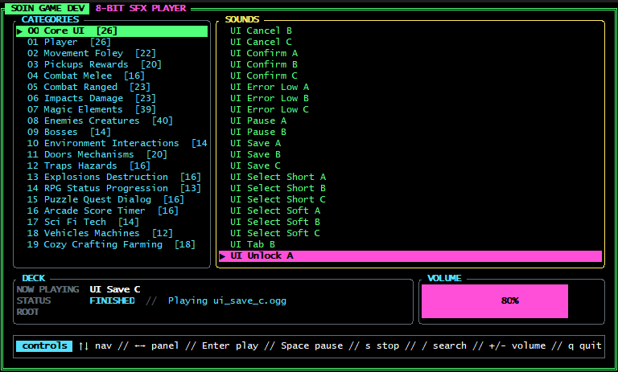

<p align="center">
  
  <br/>
  <br/>
</p>

# Soin Game Dev — Chiptune Sound Effects Library

A library of **404 chiptune sound effects** in OGG format, ready for use in 8-bit.

> **Created by:** [Soin Game Dev](https://www.soingamedev.com.br)

---

## Player



---


## 🎯 Sound Categories

| # | Category | Qty |
|---|----------|:---:|
| 00 | Core UI | 26 |
| 01 | Player Actions | 26 |
| 02 | Movement & Foley | 22 |
| 03 | Pickups & Rewards | 20 |
| 04 | Melee Combat | 16 |
| 05 | Ranged Combat | 23 |
| 06 | Impacts & Damage | 23 |
| 07 | Magic & Elements | 39 |
| 08 | Enemies & Creatures | 40 |
| 09 | Bosses | 14 |
| 10 | Environment Interactions | 14 |
| 11 | Doors & Mechanisms | 20 |
| 12 | Traps & Hazards | 16 |
| 13 | Explosions & Destruction | 16 |
| 14 | RPG Status & Progression | 13 |
| 15 | Puzzle, Quest & Dialog | 16 |
| 16 | Arcade Score & Timer | 16 |
| 17 | Sci-Fi & Tech | 14 |
| 18 | Vehicles & Machines | 12 |
| 19 | Cozy, Crafting & Farming | 18 |
| | **Total** | **404** |

## Usage

Copy the OGG files from `assets/audio/sfx/ogg/` into your game's audio directory.

Each file follows the naming pattern `<category>_<action>_<descriptor>_<variant>.ogg`.

### Example

```
player_jump_short_01.ogg
combat_sword_swing_heavy_01.ogg
magic_fireball_cast_01.ogg
```

## License

[MIT](LICENSE). Created by [Soin Game Dev](https://www.soingamedev.com.br).
